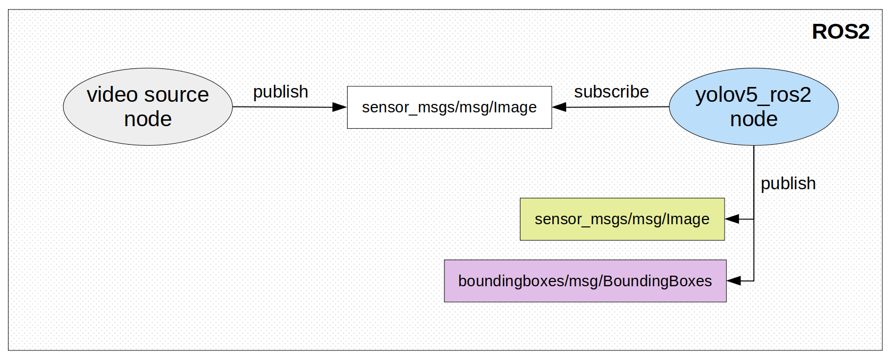

# YOLOv5 + ROS2 
State-of-the-art object detection technique, [YOLOv5](https://github.com/ultralytics/yolov5) is now compatible with ROS2<br>
[](http://www.youtube.com/watch?v=GYJsi3VHbtY "Yolo V5 with ROS2")


**Subscribed Topic**: 
  - Input image-stream ```sensor_msgs/msg/Image```<br>

**Published Topic**: 
  - Image-stream with bounding box around detected objects ```sensor_msgs/msg/Image```<br>
  - Bounding boxes (manually created message type) ```boundingboxes/msg/BoundingBoxes```

**Note:** Published image and boundingbox topics are assigned same time-stamp as that of subscribed image topic, so that input and output can be matched frame-by-frame if required for further processing.



## 1. Installation
### 1.1 Prerequisities
#### 1.1.1 Native
- Install ROS2 from the official [ROS2 website](https://www.ros.org/)<br>
For Ubuntu Linux - Focal Fossa (20.04): [ROS Foxy installation guide](https://docs.ros.org/en/foxy/Installation.html)
- Strictly necessary YOLOv5 related libraries and packages:<br>
Run the following command in terminal for [yolov5_strict_requirements.txt](yolov5_ros2/yolov5_strict_requirements.txt) file:
```
pip install -r yolov5_strict_requirements.txt
```
#### 1.1.2 Docker 

Download the docker from [RAICAM-EU-Project/isaac_ros_common](https://github.com/RAICAM-EU-Project/isaac_ros_common/tree/agipix-sim) and follow the instructions to build the image.

Mount the workspace (~/yolo_ws/) to the docker using the run_dev.sh

### 1.2 Setting-up workspace
Run the following commands in terminal:
```
# clone repo
git clone https://github.com/SasaKuruppuarachchi/yolov5_ros2_pkg.git

# create directory
mkdir -p ~/yolo_ws/src

# build workspace
cd ~/yolo_ws
colcon build --symlink-install
```
## 2. Running Object Detection
### 2.1 Video input
Here we are using webcam for testing purpose. You can also use any other video source (like Intel d435).
Open terminal shell and run the following command to initialize webcam node:
```
ros2 run image_tools cam2image
```
**Note:** the above command will start publishing image-stream with topic name '/image'

### 2.2 YOLOv5 node
Now we will start our yolov5_ros2 node to perform object detection on input image-stream
Open another shell in terminal and run the following commands:
```
# move to our workspace directory
cd ~/yolo_ws

# source ws
. install/setup.bash

# run launch file to initialize yolov5_ros2 node
# provide the input image-stream topic name as argument (in our case, its '/image')
# also provide the weight file that you want to use (default: best.pt)
ros2 launch yolov5_ros2 yolov5_ros2_node.launch.py sub_topic:='/image' weights:='yolov5s.pt'
```
